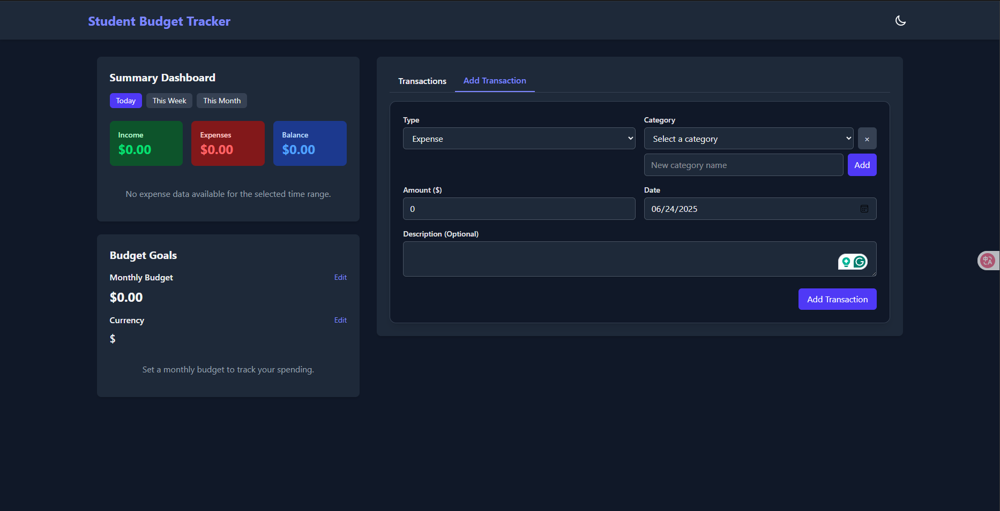

# 📊 Student Budget Tracker

A sleek, modern **Student Budget Tracker** built with **Vue.js** and **Tailwind CSS**. Effortlessly manage your finances: track income and expenses, set monthly budgets, visualize spending, and stay in control—all in a responsive, mobile-first interface.

<p align="center">
    
</p>

---

## 🚀 Key Features

### 🔹 Transaction Management
- Add, edit, and delete income or expenses
- Input details: amount, type, category, date, and description
- Powerful filters: by type, category, date, or description

### 🌙 Dark Mode
- Auto-detects your system theme
- Manual toggle with a single click
- Smooth, animated transitions

### 🎯 Budget Planning
- Set and monitor monthly budget goals
- Visual progress bars and alerts for budget limits
- Instant feedback on your spending status

### 💱 Flexible Currency
- Choose your preferred currency symbol
- Preferences saved automatically with `localStorage`

### 📊 Visual Insights
- Pie charts for expense breakdowns
- Progress bars for budget tracking

### 📱 Responsive & Accessible
- Optimized for all devices—desktop, tablet, and mobile
- Clean, adaptive layout powered by Tailwind CSS

### 💾 Local Data Storage
- All data stored securely in your browser via `localStorage`
- Create custom categories to match your lifestyle

---

## 📦 Getting Started

```bash
# 1. Clone the repository
git clone https://github.com/Rathanak-Phan/student-budget-tracker.git
cd student-budget-tracker

# 2. Install dependencies
npm install

# 3. Start the development server
npm run dev

# 4. Build for production
npm run build
```
